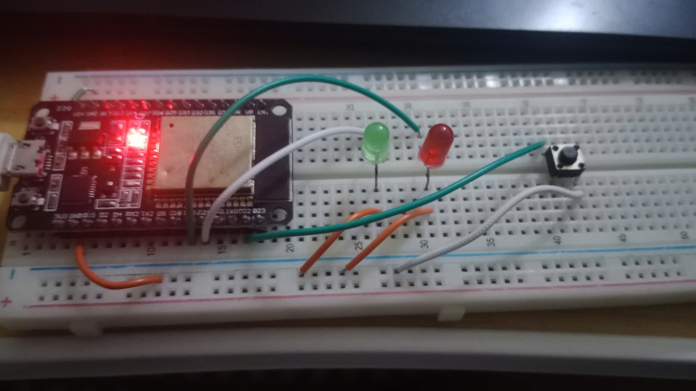
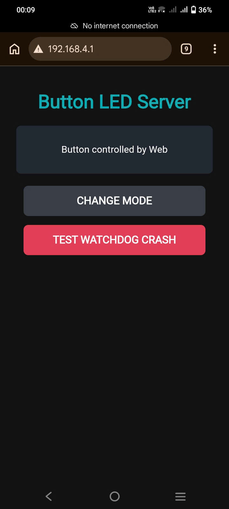

# ESP32 - IoT Smart Button Controller

An ESP32-based embedded IoT controller designed to demonstrate robust firmware architecture using **FreeRTOS**, **event-driven programming**, **interrupt handling**, **software timers**, **Task Watchdog Timer (TWDT)**, and a lightweight **Wi-Fi Web Server**.

The project goes beyond basic GPIO control by applying structured embedded software design patterns commonly used in real-time firmware systems.


---

## Project Overview

The system provides a smart button and LED controller running on the ESP32.

A physical push button and a Web interface can both generate control events. These events are processed through a centralized FreeRTOS queue and handled by a dedicated FSM task.

The firmware is designed around:

- Event-driven architecture
- Deferred interrupt handling
- Producer-Consumer architecture
- Finite State Machine (FSM)
- FreeRTOS software timers
- Task Watchdog Timer (TWDT)
- Fault recovery
- Wi-Fi SoftAP and HTTP server
- Runtime telemetry and diagnostics

### Technologies

| Category | Technology |
|---|---|
| MCU | ESP32 |
| Framework | ESP-IDF |
| RTOS | FreeRTOS |
| Language | Embedded C |
| Networking | Wi-Fi SoftAP |
| Web Server | ESP-IDF `esp_http_server` |
| Debugging | UART Telemetry |
| Reliability | Task Watchdog Timer |

---

# System Architecture

The firmware follows an event-driven architecture where hardware interrupts and network requests generate events instead of directly modifying the system state.

```text
                    ┌─────────────────────┐
                    │    Physical Button  │
                    └──────────┬──────────┘
                               │
                         GPIO Interrupt
                               │
                               ▼
                    ┌─────────────────────┐
                    │    Button ISR       │
                    │  Non-blocking       │
                    │  Debounce           │
                    └──────────┬──────────┘
                               │
                               │
                               ▼
                    ┌─────────────────────┐
                    │   Event Queue       │◄──────────────┐
                    └──────────┬──────────┘               │
                               │                          │
                               ▼                          │
                    ┌─────────────────────┐               │
                    │    FSM Task         │               │
                    │    Consumer         │               │
                    └──────────┬──────────┘               │
                               │                          │
                         State Transition                 │
                               │                          │
                 ┌─────────────┴─────────────┐            │
                 ▼                           ▼            │
        ┌─────────────────┐         ┌─────────────────┐   │
        │ Software Timer  │         │   Status LED    │   │
        └─────────────────┘         └─────────────────┘   │
                                                          │
                    ┌─────────────────────┐               │
                    │    Web Server       │───────────────┘
                    │     HTTP API        │
                    └─────────────────────┘
```

---


# Hardware Configuration

| Peripheral | GPIO | Configuration | Function |
|---|---:|---|---|
| Push Button | GPIO 22 | Input + Pull-Up | User input |
| Status LED | GPIO 19 | Output | FSM-controlled LED |
| Heartbeat LED | GPIO 21 | Output | System heartbeat |

---

# Core Features

### GPIO Interrupt & Debounce
- Button events are detected using GPIO interrupts.
- Non-blocking debounce is implemented with `esp_timer_get_time()`.
- ISR sends events to a FreeRTOS queue using `xQueueSendFromISR()`.

### FreeRTOS & Event-Driven Architecture
- Button and Web Server act as event producers.
- A centralized queue transfers events to the FSM task.
- The FSM task is the single consumer responsible for state transitions.

### Finite State Machine
```text
FAST → SLOW → OFF → FAST
```
The LED behavior is controlled according to the current FSM state.

---

### Software Timer
- FreeRTOS Software Timer controls LED blinking.
- Timer periods are changed dynamically using `xTimerChangePeriod()`.
- No dedicated delay-based task is required for LED timing.

### Watchdog & Fault Recovery
- Task Watchdog Timer (TWDT) monitors the FSM task.
- FSM state is stored using `RTC_DATA_ATTR`.
- `esp_reset_reason()` detects reset causes and restores the previous system state.

### Wi-Fi & Web Server
- ESP32 operates as a Wi-Fi SoftAP.
- **SSID:** `ESP32_ButtonLed`
- **IP:** `192.168.4.1`
- HTTP requests are converted into events and processed through the same FSM as physical button events.



### Runtime Telemetry
UART logs provide runtime diagnostics, including:

- FSM state transitions
- Free heap
- Stack high-water mark
- Button events
- System status

---

# Build & Flash

```bash
source ~/espidf/esp-idf/export.sh
cd ~/espidf/Smart-Button-Mode-Switcher/Project

idf.py build
idf.py -p /dev/ttyUSB0 flash monitor
```

---

# Future Improvements

- **NVS Persistent Configuration**  
  Store user settings and controller state in non-volatile storage.

- **OTA Firmware Updates**  
  Enable wireless firmware updates without requiring a USB connection.

- **WebSocket Communication**  
  Provide real-time device status updates through the web interface.

- **Wi-Fi Station Mode**  
  Allow the ESP32 to connect to an existing Wi-Fi network instead of operating only as a SoftAP.

- **Hardware Abstraction Layer (HAL)**  
  Further separate hardware-dependent code from application logic.

- **Unit Testing**  
  Add automated tests for FSM transitions, event handling, and control logic.

- **Event Logging**  
  Implement structured event logging for debugging and fault analysis.

- **Configuration via Web Interface**  
  Allow users to modify LED modes, timer periods, and system parameters through the web server.
